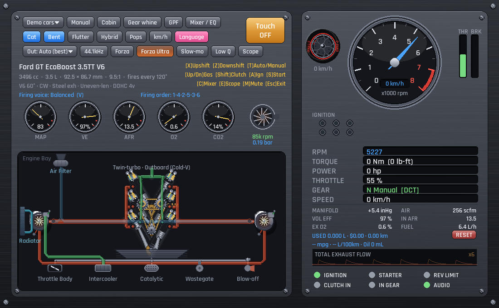

# PyEngineSim（中文）

**用纯 Python 编写的实时引擎 *声音 + 机械* 模拟器。**
作者 **Leo** · [🇬🇧 English README](README.md) · 🇨🇳 中文（本文件）

> ⚠️ **抢先体验（Early Access）** —— PyEngineSim 仍在积极开发中，可能有不完善之处、
> 功能改动和偶发 bug，欢迎反馈。

PyEngineSim 对四冲程发动机做物理建模 —— 曲轴/连杆/活塞运动学、热力学燃烧循环、
曲轴刚体动力学 —— 并把排气脉冲实时合成为 **引擎声音**。它绘制带动画的发动机舱
（活塞、配气机构、涡轮、歧管）、完整仪表盘，以及 **130+ 真实发动机预设**：从直三
到布加迪 **W16**、F1 V10、梅林 **V12** 航空发动机和转子（汪克尔）发动机。

它还能 **通过 UDP 跟随真实的极限竞速（Forza）游戏** —— 你在 Forza Horizon /
Motorsport 里开车，PyEngineSim 实时按相同转速咆哮对应的发动机。

---

## 🙏 致谢

PyEngineSim 的灵感与最大的功劳来自
**[AngeTheGreat](https://github.com/ange-yaghi)** 和他的原版 C++
**[Engine Simulator](https://github.com/ange-yaghi/engine-sim)**。请去看他的视频
并给原项目点 Star —— 正是那份了不起的作品让这个 Python 版本得以诞生。本项目是独立
重新实现，与原版 **不共享任何代码**。

---

## ⬇️ 下载与运行

| 平台 | 方式 |
|---|---|
| **Windows（快）** | 解压 `PyEngineSim-onedir.zip`，运行 `PyEngineSim/PyEngineSim.exe` |
| **Windows（单文件）** | `PyEngineSim-onefile.zip` → 单个 `.exe`（首次启动较慢） |
| **安卓（arm64）** | 侧载 `pyenginesim-…-arm64-v8a-debug.apk`（触屏 UI，SDL2 音频） |
| **源码运行** | `pip install numpy scipy sounddevice pygame` → `python run.py` |

启动默认加载 **兰博基尼 Aventador V12**；可在 **Demo cars ▾** 菜单切换任意发动机。

---

## 🎮 连接真实的 Forza 游戏（Data Out → PyEngineSim）

Forza Horizon 4 / 5 与 Forza Motorsport 能通过 UDP 输出实时遥测，PyEngineSim 会
监听并让发动机跟随游戏转速。

1. **在 PyEngineSim 中：** 点击工具栏的 **`Forza`** 按钮。按钮颜色表示连接状态 ——
   **🔴 红** = 正在监听但还没数据，**🟢 绿** = 已收到 Forza 数据包。PyEngineSim
   监听 **UDP 端口 `5300`**。
2. **在 Forza 游戏中：** 打开 **设置 → HUD 与游戏（Horizon）/ 游戏与 HUD
   （Motorsport）**，设置：
   - **Data Out（数据输出）：** `开`
   - **Data Out IP 地址：** 取决于你拥有的是哪个版本的 Forza（见下方说明）。
   - **Data Out 端口：** `5300`
   - **（Horizon）** 选择 **“Dash”** 格式。
3. 开始驾驶。**Forza** 按钮变 🟢 绿，发动机即跟随游戏的转速 / 油门 / 增压。

> **⚠️ 该填哪个 IP？取决于 Forza 版本（同机情形）：**
> - **Steam 版** —— 普通 Win32 程序，回环可用：填 **`127.0.0.1`**。
> - **微软商店 / Xbox Game Pass 版** —— 沙盒化的 **UWP** 应用，Windows **禁止 UWP
>   回环**，`127.0.0.1` 收不到。请改填本机的 **局域网 IP**（如 `192.168.1.x`，用
>   `ipconfig` 查看）。
>
> 若游戏和 PyEngineSim 在 **不同电脑** 上，则无论哪个版本，都填运行 PyEngineSim
> 那台电脑的局域网 IP。

> **同机性能：** 若游戏本身很吃性能，把 PyEngineSim 切到下面的 **Forza Ultra**，
> 它几乎不占资源。

---

## ⚡ 性能模式（低画质 与 Forza Ultra）

16 缸发动机的舱体渲染较重。两个开关用画质换 CPU，保证音频线程不卡（不爆音）：

- **`Low Q` 低画质渲染。** 一切都画成 **无阴影的纯色实心形状**：气缸、管道、涡轮、
  皮带/齿轮、仪表和车轮全部单色，关闭缸内爆炸闪光，关闭半透明。大约 **把重帧砍掉
  一半** —— 画面更简单，数据完全不变。可随时手动开关。
- **`Forza`。** 进入 Forza 遥测模式会 **自动开启低画质**，冻结所有旋转部件（涡轮、
  齿轮、螺旋桨 —— 只有 **活塞和仪表盘** 还在动），并关闭波形示波器 / 点火指示灯。
  退出 Forza 会还原你之前的低画质设置。
- **`Forza Ultra` 关闭显示。** 屏幕除了它自己的按钮、**Demo cars** 菜单和一个
  **Mixer/EQ** 开关外什么都不画。发动机照常运行并通过 UDP 跟随 Forza，但渲染几乎
  不画任何东西（约 0.9 毫秒/帧），几乎把整颗 CPU 让给游戏 + 音频。**实际比赛时
  最佳。**

---

## ⌨️ 操作

| 按键 | 功能 | | 按键 | 功能 |
|---|---|---|---|---|
| `↑ / ↓` | 油门 / 刹车 | | `A` | 点火开关 |
| `Shift`（按住） | 离合 | | `S`（按住） | 起动机 |
| `X` | 升挡 | | `Z` | 降挡 |
| `T` | 自动 / 手动 | | `C` | 混音 / EQ |
| `E` | 示波器 | | `M` | 静音 |
| `V` | 点火音色 | | `Esc` | 退出 |

右上角的 **Touch** 开关会弹出屏幕踏板/拨片（触屏用）；安卓上默认开启。

---

## 🛠️ 自行构建

- **Windows exe：** `pip install pyinstaller`，然后
  `pyinstaller packaging/PyEngineSim.spec`（快速的文件夹版）或
  `packaging/PyEngineSim-onefile.spec`（单文件版）。
- **安卓 apk：** 在 Linux/WSL 上用 `buildozer`（见 `buildozer.spec`）。pygame /
  SDL2 只能在 **python‑for‑android `v2023.09.16`（Python 3.10）+ NDK r25b** 下编译；
  更新的组合会在 `longintrepr.h` / `ALooper` 处失败。

---

*PyEngineSim —— 作者 **Leo**。抢先体验（Early Access）。特别感谢 **AngeTheGreat**
的 Engine Simulator。*
